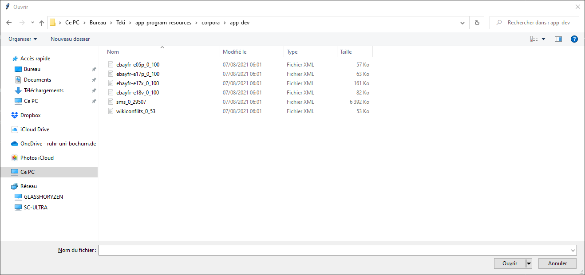
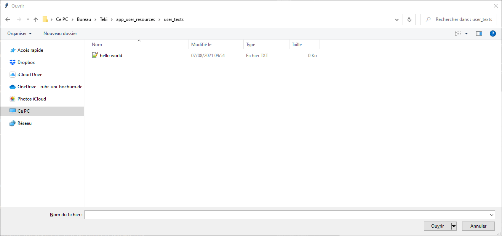
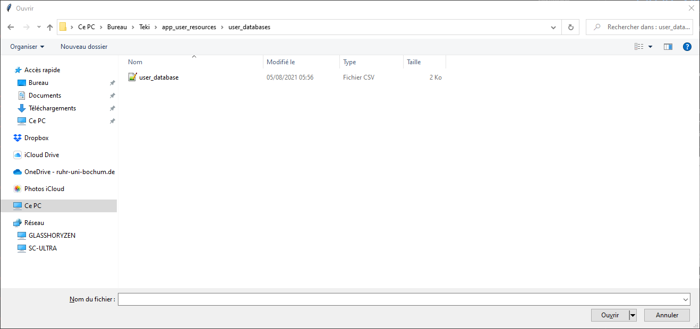

# Academic Formalities

## Student Information

Information | Description
------------- | -------------
Name | Christopher Michael Chandler
Matrikelnummer | 108017107247
 Erstfach | Linguistik B.A, 6. Semester
Zweitfach | Romanische Philologie Franzoesisch B.A, 9. Semester
Titel | From T’es Qui to Qui Es-Tu: A Naïve Bayesian Approach to Assessing Literate and Oral Discourse in Nonstandard French Language Data
Kurs | Schriftliche Hausarbeit für die Bachelorprüfung der Fakultät für Philologie an der Ruhr-Universität Bochum (Gemeinsame Prüfungsordnung für das Bachelor/Master-Studium im Rahmen des 2-Fach-Modells an der RUB vom 03. November 2016)
___

## Preface

The layout of this program was partly inspired by a computational linguistics project called " Erkenner von Unicode-Emojis und ASCII-Emoticons sowie entsprechender Neubildungen" that I did with a partner in the summer semester of 2020 (Chandler & Cultraro, 2020). The goal of that project and its program was to recognize emoticons, both old and new, and emojis within a given text. The inspiration, and to a certain extent the contribution, for this program is therefore limited to the dynamic menu system, file structure and control structure that is used within this program.

As this is a linguistic project, there are files pertaining to protoypical sentences and texts that are representative of the conceptual literacy and conceptual orality (Cook, 2012; Goudailler, 2002; Müller, 1975). The three primary corpora that are the focus of the linguistic analysis: eBay petites annonces (Gerstenberg & Hewett, 2019) CMR-wikiconflits (Poudat et al., 2015) and 88milsms (Panckhurst et al., 2014), which will be referred to as eBay, Wikiconflits or Wikipedia, and SMS respectively. 

Please refer to the references for information on how to obtain the specific corpora used within this project. 

## References 
____
Chandler, C., & Cultraro G. (2020) <i> Erkenner von Unicode-Emojis und ASCII-Emoticons sowie entsprechender Neubildungen [Gray literature]</i>. 

Cook, J. (2012). Les marques lexicales du français familier dans la traduction polonaise des dialogues romanesques. <i>Traduire, 226</i>, 93–107. https://doi.org/10.4000/traduire.162

Gerstenberg, A., & Hewett, F. (2019). <i>A collection of online auction listings from 2005 to 2018 (anonymised) </i>[Data set]. La-bank: Resources for Research and Teaching. https://www.uni-potsdam.de/langage/la-bank/ebay.php

Goudailler, J.-P. (2002). De l’argot traditionnel au français contemporain des cités. <i> La linguistique, 38(1)</i>, 5–24. https://doi.org/10.3917/ling.381.0005

Müller, B. (1975). <i>Das Französische der Gegenwart: Varietäten, Strukturen, Tendenzen</i>. Winter. 

Panckhurst, R., Détrie, C., Lopez, C., Moïse, C., Roche, M., & Verine, B. (2014). <i> 88milSMS. A corpus of authentic text messages in French </i> (ISLRN 024-713-187-947-8; cmr-88milsms-tei-v1) [Data set]. ISLRN . https://hdl.handle.net/11403/comere/cmr-88milsms/cmr-88milsms-tei-v1

Poudat, C., Grabar, N., Kun, J., & Paloque-Berges, C. (2015). <i> TEI-CMC version of Wikipedia discussions associated to the article “Quotient intellectuel”</i> (cmr-wikiconflits-qi_discu-tei-v1) [Data set]. CoMeRe Corpora Repository. https://hdl.handle.net/11403/comere/cmr-wikiconflits/cmr-wikiconflits-qi_discu-tei-v1
_____

## Eigenständigkeitserklärung
```
Hiermit versichere ich, dass ich die Arbeit selbständig angefertigt, außer den im Quellen- und
Literaturverzeichnis sowie in den Anmerkungen genannten Hilfsmitteln keine weiteren benutzt und
alle Stellen der Arbeit, die anderen Werken dem Wortlaut oder dem Sinn nach entnommen sind,
unter Angabe der Quellen als Entlehnung kenntlich gemacht habe. 

Kamen, 23.12.2021
Christopher Chandler 
```

## Declaration of Authenticity 

```
I hereby declare that the work submitted is my own and 
that all passages and ideas that are not mine have been fully and properly acknowledged.
I am aware that I will fail the entire course should I include passages and 
ideas from other sources and present them as if they were my own.

Kamen, 23.12.2021
Christopher Chandler 
```

# Téki: A Naïve Bayesian French Discourse Analyzer
## Project information


[](https://opensource.org/licenses/MIT)

# What is Teki?

Teki is a [naïve Bayes classifier](https://web.stanford.edu/~jurafsky/slp3/4.pdf) that is used to classify French sentences according to conceptual literacy and orality. 

The name 'Teki' pronounced as /Tɛki/ comes from a phonetic transcription of the informal phrase  *t'es qui?* - *you are who?*.
It is reminiscent of Stromae's 2013 song - *Papoutai* - *Papa ou t'es* - lit. *Father, you are where?*
This word order is a form of topicalization that is actually quite common in French even if it is not necessarily exclusive to the language itself. Topicalization is one of the features that can be used to identifiy conceptual orality in a  message. Thus, The name was chosen to reflect the process of researching conceptual and medial literacy and orality and how they are realized within the French language.

By introducing other parameters that are language-independent such as, but not limited to, sentence length, abbreviations, average word length, contractions, etc, it was possible to identify conceptual literacy and orality even within a textual medium. This program was designed with the goal of accessing the nature of non-standard French data gathered from eBay, Wikipedia, and SMS. 

Since no training data could be found that was adequate for the scope of this project, training data had to be created. Using the aforementioned parameters, classification sets were created to automatically create training data  pertaining to conceptual literacy and orality. After having done so, Teki was trained on this data so that it could probabilistically assign a feature to an unknown sentence based on sentences it had previously seen. 

The program works using the tags LIT and ORAL: LIT refers to the conceptually literacy and ORAL refers to conceptual orality.

For more information on this topic  and the development of this program,
please consult the program documentation located in the app_program_documentation folder. 

# License 

## MIT License


```
Copyright (c) 2021 Christopher Chandler

Permission is hereby granted, free of charge, to any person obtaining a copy
of this software and associated documentation files (the "Software"), to deal
in the Software without restriction, including without limitation the rights
to use, copy, modify, merge, publish, distribute, sublicense, and/or sell
copies of the Software, and to permit persons to whom the Software is
furnished to do so, subject to the following conditions:

The above copyright notice and this permission notice shall be included in all
copies or substantial portions of the Software.

THE SOFTWARE IS PROVIDED "AS IS", WITHOUT WARRANTY OF ANY KIND, EXPRESS OR
IMPLIED, INCLUDING BUT NOT LIMITED TO THE WARRANTIES OF MERCHANTABILITY,
FITNESS FOR A PARTICULAR PURPOSE AND NONINFRINGEMENT. IN NO EVENT SHALL THE
AUTHORS OR COPYRIGHT HOLDERS BE LIABLE FOR ANY CLAIM, DAMAGES OR OTHER
LIABILITY, WHETHER IN AN ACTION OF CONTRACT, TORT OR OTHERWISE, ARISING FROM,
OUT OF OR IN CONNECTION WITH THE SOFTWARE OR THE USE OR OTHER DEALINGS IN THE
SOFTWARE.
```
# Program Requirements 

## Tested on:
  

## Python Version
This program was created and designed with **3.9.6** in mind and is therefore the recommended version.
It is possible to run the program using any version **above 3.6**, but program stability cannot be guaranteed. You can download the [latest python version at the official website](https://www.python.org/downloads/). 


## Modules and Libraries

### **Standard**
This program makes use of the following standard libraries:

```
csv
datetime
json
logging
os
re
shutil
statistics
sys
timeit
tkinter
```

### **Pip** 
In addition to these modules, the following [pip](https://www.python.org/downloads/) packages must be present for the program to run properly:


* [spacy>=2.3.5](https://pypi.org/project/spacy/)
* [beautifulsoup4>=4.9.3](https://pypi.org/project/beautifulsoup4/)
* [bs4>=0.0.1](https://pypi.org/project/beautifulsoup4/)
* [lxml>=4.6.1](https://pypi.org/project/lxml/)
* [pandas~=1.1.5](https://pypi.org/project/pandas/)
* [sklearn~=0.0](https://pypi.org/project/scikit-learn/)
* [scikit-learn~=0.24.2](https://pypi.org/project/scikit-learn/)
* [future~=0.18.2](https://pypi.org/project/future/)

Before the installation, 
please also ensure that there is enough disk space so that the extra modules can be installed. 

There are three ways to install the libraries and modules:

1) Install all modules individually via the pip installer:
```
pip install module_name
```
2) Install all modules with pip using the *requirements.txt* without specifying the version number:
```
pip install -r requirements.txt
```
3) install with pip using the *requirements.txt* with specifying the version number:
```
pip3.9 install -r requirements.txt
```
Note: This  is only necessary if there are multiple python versions installed on the computer.

In addition to those, the following for spaCy must also be installed separately:
```
python -m spacy download fr_core_news_sm
```

If problems arise with during the installation of any of the modules or libraries, 
please consult the respective module repositories 
# Program

To start teki, run the file ***teki_main_app.py***.
By doing so, it will also import the secondary python file **app_auxiliary_functions.py**  - located in 
**app_program_resources** - ,which contains secondary functions that are necessary for the program to run properly.


## File check

When starting the program, a check is performed to ensure that the directory **app_program_resources** and its files are all present. **These files should not be changed in any way**. If the user decides to add databases, corpora, texts, etc. to this program, then they should be placed in **app_user_resources** in their respective folders.

```
The current time is 06:17:32.
Please wait while libraries, modules and corpora are being imported...
This should take between 5 - 30 seconds depending on your system resources...
```
Note: The ideal startup time should be no more than 10 seconds.

### **Missing files**
If the files have been moved or corrupted, then the following prompt will be displayed to the user:

```
An error has occurred probably because files, libraries or directories are missing:

Default doc exists:  True
Default train exist:  True

Files Missing:
app_program_resources\app_corpora\app_test\telsting\ebayfr-e17p_201_300.xml


Please enter the number of your response:
0 yes
1 no

Would you like to continue with the program? 
```

### **Missing Functions** 

If functions have been renamed or are missing from **app_auxiliary_functions.py**,
the following prompt will appear

```
The following error has occurred:
cannot import name 'evaluagtion' from 'app_program_resources.app_auxiliary_functions
(app_program_resources\app_auxiliary_functions.py)

Would you like to proceed despite this error?

Please enter the number of your response:
0 yes
1 no
```

Note: This error should not occur as long as the app_auxiliary_functions.py and its functions have not been altered in any way. 

### **Continue Despite Error** 

In either case, the user can continue using the program despite the program not having access to all files or functions. However, program stability cannot be guaranteed. 
Please consult teki_error.log, which is located in the main directory if program instability does arise. 

## Program Start
If the modules, files and libraries have been successfully loaded, the user should be greeted with the following: 

```
The current time is 13:31:26.
Please wait while libraries, modules and corpora are being imported...
This should only take between 5 - 30 seconds depending on your system resources...

All libraries were loaded 9 seconds. The program can now start.

You are currently using the app_common_default_docs files:

Default Text: 'app_program_resources/default_files/muller_corpora/mueller_oral.txt'
Default Training: 'app_program_resources/default_files/databases/default_database.csv'
 
If you wish to proceed with other files, please load them from respective directories.

      ~ Teki - French Discourse Analyzer ~        
               #### Main Menu ####
 ```

* [1: load .xml or .txt file](#menu_item_1)
* [2: load training file](#menu_item_2)
* [3: analyze contents](#menu_item_3)
* [4: sentence classification](#menu_item_4)
* [5: clear error log file](#menu_item_5)
* [6: restore default database](#menu_item_6)
* [7: evaluation](#menu_item_7)
* [8: about program](#menu_item_8)
* [9: end program](#menu_item_9)

This is a dynamic menu to which the user can return. Should an error arise in the program, 
the user will automatically be redirected to this menu. The default files are loaded in automatically, but can be changed by the user. 


# <a name="menu_item_1"> 1 load .XML or .TXT file</a>

When first starting the program, the program will run using the following default file:
 ```
Default Text: 'app_program_resources/default_files/mueller_oral.txt'
 ```
If the user would like to change this, then it is necessary to choose a new file. 
The program comes with corpora and it is designed to be used with these corpora. 
Simply click on the .xml file that should be read into the program. 
The subdirectories containing the .xml files 
can be found in the **app_program_resources** under **app_corpora**.

### **.Xml**
----
The user will be presented with a file dialog to select the desired file:
 


### **.Txt**
---
The user can select a desired .txt file from **app_program_resources/default_files/muller_corpora**.

Alternatively, a user can also input any .txt file regardless of its location.

 

⚠️ 

**Note** 
The file must have .txt or .xml ending. 
Also, it must only contain text and tags (if .xml) or only text (if .txt) 
Other file formats such as .pdf, .doc, .xml, etc. are not supported and could lead to the program unexpectedly crashing. 
<br>⚠️

After having selected a file, the file will be loaded into memory and the user will be returned to the main menu.

# <a name="menu_item_2">2: load training file</a>

 ```
Default Training: 'app_program_resources/default_files/default_training.csv'
 ```
All database, i.e., training files must be saved in a .csv format and have the following structure:

| Token | POS | Dependency | Sentence Id | Corpus Id | Feature |
|----------|------|------------|-----------|-------------|---------|
| ENSEMBLE | NOUN | ROOT  | SEN:0 | e05p-001| LIT  |

These are referred to as training files because they are used to train Teki. At the same time, 
they are also database file because they contain the training data.

As with loading a .txt or .xml file, if the user does not wish to use the default database, 
a different database can also be selected dynamically. 
Default databases can be found under **app_program_resources/default_files/databases**.

If the user has trained and saved databases, then they should be saved under **app_user_resources/user_databases** . If no  custom databases currently exist, simply create **an empty .csv** file, place it in the appropriate folder and then load it. The results of the training will be saved to selected file. 

 

After having selected a file, the file will be loaded into memory and the user will be returned to the main menu.

# <a name="menu_item_3"> 3: analyze contents</a>

Using this function, it is possible to generate training data for Teki, extract sentences from a specific corpus or read the files that have been loaded into the system. 
Training data can either be gathered using .txt or .xml files. From where the training data is gathered will depend entirely on the files that the user has loaded into memory. If no files have been loaded into memory by the user, then the the default files will automatically be used.  Once the training data has been generated, it will be either saved to the default database file or 
to the database file  that was previously selected by the user. 

After having loaded  the desired files or progressing with the default files, the user is greeted with the following submenu:

```
Content Analysis     
 How would you like to proceed with the file?
```
 
* [1: read file contents](#read_file)
* [2: analyze .XML data](#xml_data)
* [3: analyze .TXT data](#txt_data)
* [4: return to main menu](#return_to_menu_0)

```
Please enter the desired menu number:
```

### <a name="read_file">1: read file contents</a>
This displays the content of the .xml or .txt file to the user. After which the user is brought back to
the submenu.

### <a name="xml_data"> 2: analyze .XML data</a>

There are three main corpora available within the program: 

```
1 eBay
2 SMS
3 Wikipedia
```

Once a corpus has been chosen, the user will have option of inputting a range of tags to be extracted from the corpus.

```
There are 100 documents. Please enter a selection range from 0 - 100.
 A range should be specified as follows with a single space between both numbers: start stop.
```

The speed and efficacy of this process is highly dependent on the system resources of the user, the python version installed and the range as specified by the user. The longer the range, the more time it will take for the program to parse and analyze everything correctly and efficiently. It is therefore recommend that **the max range should be no more than 100**. 

**Example Range**
| start | stop |
|-------|------|
| 0   | 10  |

It is possible to enter a range that spans the entire corpus, but this is not advised as it could lead to program instability. 

Note:

The program could theoretically work with any .xml file. The program has been designed to work with these three corpora. Working knowledge of Python would allow for one to easily alter the .xml parsing process within the program. 

To do so, please refer to function xml_analysis within the python code. However, it should be noted that these three corpora provide at least ca. 100,000 sentences and offer a wide arrange of possibilities with respect to linguistic analysis. Therefore, they should suffice for the average user.
___

## Proceeding with the Corpus Selection

* [1: process sentences](#process_sentences)
* [2: save unprocessed](#unprocessed_sentences)
* [3: return to menu](#return_to_menu_1)

### <a name="process_sentences">1: process sentences </a>

There are two main ways in which this function can be used: 

### **Classification Evaluation**
____

If this is activated, then the choices of assigning features manually or automatically are deactivated.

There is an experimental function that allows for the creation of a system file and a gold file. 
This is done by setting the parameter **system_evaluation** to **True** . This must be done from within the program. 

```
Note: This is an experimental function that might not deliver the best results.
The system is being evaluated. Please press enter to start the evaluation...
```

If system_evaluation is implemented, then a system and gold file will be saved under **app_user_resources/system_evaluation**. These can then be used to evaluate the classification system. The system file is based on language-independent criteria while the second file is created using French-based criteria. 

The language-independent criteria can then be evaluated using the following function <a name="evaluate"> Evaluate using system and gold files</a>.

This function was not developed further as it did not provide reliable results as too many of the sentences in the gold file were being classified as unknown. 

For information on why this is, please consult the program documentation.

### **Default Setting**
____

Processing the sentences means that spaCy will analyze them
to retrieve linguistic relevant information. If the user wishes to train or build up their own
database, then they must proceed with this option.

Once a range has been entered, the sentences will then parsed, analyzed and assigned a unique identifier. 
Afterwards, the following option selection will appear:

```
The sentences have been successfully processed.
Please press enter to continue...
1 automatically
2 manually
```

In both cases, a unique identifier will be assigned to each sentence so that it can be found in the corpus, should the user 
wish to manually inspect the database. This identifier is also available to the system and necessary so that it it can
correctly read in the databases later. 

### **1 manually**
___

If the user already knows the features or wants to specify the features that should be assigned to the respective sentences, the user may do so here by using the following features. 
1. LIT
2. ORAL

The feature will then be applied to every sentence within the corpus as previously selected by the user. Therefore, this feature should only be used if the user knows that all sentences are of the same kind, i.e. all sentence should receive the same feature. 

### **2 automatically**
____
This is the preferred method as the program uses the classification criteria to gauge the most appropriate feature and assign it to each sentence respectively. The feature LIT or ORAL will the n be assigned my by the program itself. 

For more information on the scoring system and how this works, please consult the documentation. 
___

### Creation of Training Data
Once the corpus range has been analyzed by spaCy and then assigned its respective feature 
according to conceptual orality or literacy, the results are saved to the database file that 
was selected by the user. The user is then returned to the main menu. 
___

### <a name="unprocessed_sentences">2: save unprocessed sentences </a>
If the user is simply interested in retrieving the sentences from the corpus, 
then the user should proceed with this option. 
The results will automatically be saved in a file under **app_user_resources/sentence_results**.
The user will then be returned to the main menu, where the user can safely exit the program. 

### <a name="return_to_menu_0">3: Return to menu </a>
This will bring the user back to the main menu.

```
The sentences will neither be saved nor processed. 
Please press return to return to the main menu...
```
____

### <a name="txt_data"> 3: analyze .TXT data</a>
This process is largely similar to that of the .xml process as described above. The only real difference here is that the user must specific a unique identifier that is to be assigned to this text. Note that this identifier is not the same as the feature, but rather an indicator so that the user and the program can identify from corpus the sentence came from. 

```
Please enter a unique identifier ONLY using number of characters from (a-z, A-Z, 0-9) for this text: 
```

### <a name="return_corpus_menu"> 4: return to main menu</a>
The user is returned to the main menu

# <a name="menu_item_4"> 4: sentence classification</a>

Once a database has been selected, it possible for a document to be classified by the naïve Bayes formula: 

```
The database contains sentences with the following features:
LIT: 30
ORAL: 24
```
* [1: analyze an individual sentence](#enter_sentence)
* [2: analyze sentences of a file](#enter_document)
* [3: return to main menu](#classify_main_menu)

### <a name="enter_sentence"> 1: analyze an individual sentence </a>
If the user wishes to simply analyze just one sentence, then use this function. 
The user will then be prompted to enter a **French sentence**.   

After having successfully entering a sentence, the program will return an answer based on the training data available to it. LIT indicates conceptual literacy, with ORAL being conceptual orality.

The answer provided by teki will depend on the training data provided.
The more reliable the training data, the more reliable the answer will be. 

The user will be returned to the submenu and will have the option of entering a sentence again. 

Note:

It is possible to enter something that is not a French sentence. However, these answers are to be ignored because they simply rely on default values when the program does not know which exact response it should give. 

### <a name="enter_document"> 2: analyze sentences of a file </a>
This will pull up the <a name="menu_item_3"> analyze contents menu </a> and it follows the same process. 
The user should consult the chapter if the user has not already done so. 

Note: 

Due to the problem of underflow, a document as a whole cannot be properly analyzed. That is why the document will only be 
analyzed on a sentence by sentence level. The program will return the most appropriate feature per sentence, not necessary per document. 

After the analysis, the files will be saved in **app_user_resources/naive_bayes_results**.
the user can chose to exit the program or continue with other sentences/documents. 

### <a name="classify_main_menu"> 3: return to main menu</a>

This will return the user back to the main menu.
___

# <a name="menu_item_5"> 5: clear error log file</a>

Should unforeseen errors arise within the program, they will be saved within teki_error.log. 
Errors can occur due to :
1. not reading in files 
2. reading unsupported files such as .pdf, .doc(x)
3. altering the app program directory 
4. altering the programs source code 
5. Missing libraries or modules 

⚠️ **Note:** this function will erase your error report and the data of which cannot be recovered. ⚠️


# <a name="menu_item_6"> 6: restore default database</a>

The user may build upon the default database provided with the program. However, 
if this database becomes corrupt or becomes imbalanced due to improper training,
the user may reset the database using this function.

⚠️ **Note:** this function will erase all of your progress and the results of which cannot be recovered. ⚠️

# <a name="menu_item_7"> 7: evaluation</a>


This function requires reference files, i.e., system files and gold files in order for it to work. 
The gold files must be created by hand as the program is currently incapable of generating them.

Which files would you like to evaluate:  
 
* [1: evaluate using system and gold files](#evaluate)
* [2: cross validation](#validate)
* [3: return to main menu](#evaluation_main_menu)

### <a name="evaluate"> 1: evaluate using system and gold files</a>

This evaluator takes in two files: a system file and gold file. 

The system file are the sentences that were produced by the program. 
This is not the same as the database files created by the system. 

The format of both files should be as follows: 

| Sentence              | Sentence Number | Corpus ID | Feat |
|----------------------------------------------------------------|-----------------|------------|------|
| A noter que le film n' est pas <br> encore sorti en dvd en France ! | SEN:4   | e05p-005-4 | ORAL |


Once both files are present, the user will be prompted to first select the system file and then gold file. The program will compare the two files and return the following values: 

```
Accuracy
Error Rate 
Precision 
Recall 
F-Score
```

This function can be used to evaluate to the reliability of the naive Bayes and the classification sets. 


### <a name="validate">2: cross validation</a>
The cross validation works the same way as <a name="evaluate"> evaluate using system and gold files</a>, but it only requires one file to work. 

Before a file has been selected, the user must first place: 
```
sentence,sentence_number,corpus_id,feat
```

at the top of this file in order for it to be read properly. 
Once having done so, the results of the cross validation will be shown within the program. 


### <a name="evaluation_main_menu"> 3: return to main menu</a>
This brings the user back to the main menu. 
____

# <a name="menu_item_8"> 8: about program</a>
This function provides the user with this readme file.
The user can therefore access the program information from the menu. 

# <a name="menu_item_9"> 9: end program</a>
The user can force exit the program by killing the script, but this could lead to file corruption. Therefore, using this function is the preferred way of exiting program because the results from the other functions are only saved to the respective files once the user has properly exited the program. 
