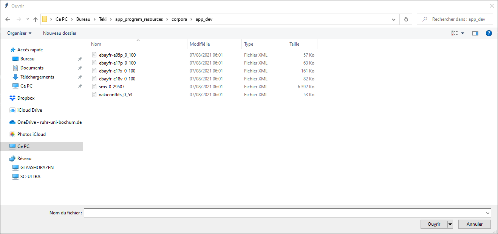

# Téki:  A Naïve Bayesian French Discourse Analyzer

 
 

 [](https://opensource.org/licenses/MIT)

___
The name 'Teki' pronounced as /Tɛki/ comes from a literal transcription of the informal phrase  t'es qui' - 'Who are you'.
It is reminiscent of Stromae's 2013 song - Papoutai - Papa ou t'es - lit. Father, you are where?
It there contrasts with the more formal phrase "Qui es-tu". The spelling of the name is meant to represent this. 
This form of topicalization is actually quite common in French even if it is not necessarily exclusive to the language itself. 

The name was chose to reflect the process of researching the conceptual and medial representation of the French language. 
Message and intent are often communicated either through text or speech. However, these two only represent the medium of the language. 
The difference between the conceptual and medial representation of language is often overlooked when assessing language. 
The phrase "someone writes how they speak" reflects this mentality. The train of thought is translated into a written medium, but
the words actually reflect a stream of consciousness if you will. 

Teki is a naive Bayesian classifier that is used to tag French chat data according to their literacy and orality. 
Since there was no training data available for the naive bayes, a scoring system was developped that tagged sentences according to 
their literacy and orality. Then, using this newly acquiered training data, the naive bayes was trained so that it could decide 
if a sentence was literal or oral. 

For more information on this topic, please consult the documentation  
 
## Academic Formalities
Information  | Description
------------- | -------------
Name | Christopher Michael Chandler
Matrikelnummer | 108017107247
 Erstfach | Linguistik B.A, 6. Semester
Zweitfach | Romanische Philologie Franzoesisch B.A, 9. Semester
Titel  | From T’es Qui to Qui Es-Tu: A Naïve Bayesian Approach to Assessing Literate and Oral Discourse in Nonstandard French Language Data
Kurs   | Schriftliche Hausarbeit für die Bachelorprüfung der Fakultät für Philologie an der Ruhr-Universität Bochum (Gemeinsame Prüfungsordnung für das Bachelor/Master-Studium im Rahmen des 2-Fach-Modells an der RUB vom 03. November 2016)
___

# License 
MIT License

Copyright (c) 2021 Christopher Chandler

Permission is hereby granted, free of charge, to any person obtaining a copy
of this software and associated documentation files (the "Software"), to deal
in the Software without restriction, including without limitation the rights
to use, copy, modify, merge, publish, distribute, sublicense, and/or sell
copies of the Software, and to permit persons to whom the Software is
furnished to do so, subject to the following conditions:

The above copyright notice and this permission notice shall be included in all
copies or substantial portions of the Software.

THE SOFTWARE IS PROVIDED "AS IS", WITHOUT WARRANTY OF ANY KIND, EXPRESS OR
IMPLIED, INCLUDING BUT NOT LIMITED TO THE WARRANTIES OF MERCHANTABILITY,
FITNESS FOR A PARTICULAR PURPOSE AND NONINFRINGEMENT. IN NO EVENT SHALL THE
AUTHORS OR COPYRIGHT HOLDERS BE LIABLE FOR ANY CLAIM, DAMAGES OR OTHER
LIABILITY, WHETHER IN AN ACTION OF CONTRACT, TORT OR OTHERWISE, ARISING FROM,
OUT OF OR IN CONNECTION WITH THE SOFTWARE OR THE USE OR OTHER DEALINGS IN THE
SOFTWARE.
_____

# Inspiration
The layout of this program is partly inspired by a project that I did with a partner in the summer semester of 2021. 
The inspiration is limited to the dynamic menu system that is sued within this program.  


# Requirements 

## Python Version
This program was created and designed with **3.9.6** in mind. Therefore, that is the recommended version for teki. 
It is possible to run the program using any version **above 3.6**, but program stability cannot be guaranteed.
<br>You can download the latest python version [ here](https://www.python.org/downloads/).  

## Modules and Libraries

This program makes use of the following standard libraries:

```
csv
datetime
json
logging
os
re
sys
timeit
tkinter
shutil
```

In addition to these, the following pip packages must be present in order for the program to run properly:

```

bs4>=0.0.1
beautifulsoup4>=4.9.3
nltk>=3.5
lxml>=4.6.1
pandas~=1.1.5
sklearn~=0.0
scikit-learn~=0.24.2
spacy>=2.3.5
```

There are three ways to install the *requirements.txt* file:

* 1) Install all modules individually via pip.
<br><br>
* 2) install all modules with pip using the requirements.txt without specifying the version number:
```
pip install -r requirements.txt
```
<br>

* 3) install with pip using the requirements.txt with specifying the version number:
```
pip3.9 install -r requirements.txt
```

<br>
Additionally, the following for spacy must also be installed separately:

```
python -m spacy download fr_core_news_sm
```

# Program

## File check

When starting the program, a check is performed to ensure that the directory **app_program_resources** and its files are all present. These files should not be changed in any way. If you decide to add databases or corpora to this program, they should be placed in **app_user_resources**.
```
The current time is 06:17:32.
Please wait while libraries, modules and corpora are being imported...
This should only take between 3 - 10 seconds depending on your system resources...
```

### Failure to start 
If the files  have been moved or corrupted, then the following prompt will be displayed to the user. 

```
The app resource directory is either missing, has been renamed or the file has been altered in some other way.

0 yes
1 no

Would you like to continue with the program? 
```

The user can continue using the program despite the program not having access to all files.
However, program  stability cannot be guaranteed.


## Program start
If the modules, files and libraries, have been successfully loaded, you should be greeted with the following: 

```
All libraries were loaded 9 seconds. The program can now start.

You are currently using the app_common_default_docs files:

Default Text: 'app_program_resources/default_files/mueller_oral.txt'
Default Training: 'app_program_resources/default_files/default_training.csv'
 ```

* [1: load .XML or .TXT file](#menu_item_1)
* [2: load training file](#menu_item_2)
* [3: analyze contents](#menu_item_3)
* [4: document classification](#menu_item_4)
* [5: clear error log file](#menu_item_5)
* [6: restore default database](#menu_item_6)
* [7: evaluation](#menu_item_7)
* [8: about program](#menu_item_8)
* [9: end program](#menu_item_9)

This is a dynamic menu to which you can return. Should an error arise in the program, you will automatically be returned to this menu. 


# <a name="menu_item_1"> 1 load .XML or .TXT file</a>

When first starting the program, the program will run using the following files. 
 ```
Default Text: 'app_program_resources/default_files/mueller_oral.txt'
 ```
If the user would like to change this, then it is necessary to choose a new file. 
The program comes  with corpora and it is designed to be used with this corpora. 
It is possible to dynamically select the file. 
Simply click on the .xml file and it will be read into the program. 

 

Alternatively, you can click on any .txt and the program will  progress just the sample 

# <a name="menu_item_2"> 2: load training file</a>

 ```
Default Training: 'app_program_resources/default_files/default_training.csv'
 ```

If the user does not wish to use the default database, 
a different database can also be selected dynamically. 
After having selected a file, the user will be returned to the main menu.


 

All database files must be saved in a .csv format and has the following structure

| Token    | POS  | Dependency | Corpus Id | Sentence Id | Feature |
|----------|------|------------|-----------|-------------|---------|
| ENSEMBLE | NOUN | ROOT       | e05p-001  | SEN:0       | LIT     |


The user can either select databases that are available in **app_program_resources**
or train the model and save the results in **app_user_resources/user_databases**

After having selected a file, the user will be returned to the main menu.

# <a name="menu_item_3"> 3: analyze contents</a>

After having loaded in the desired files or progressing with the default files,  
the user is greeted with the following submenu:

Content Analysis                 
  How would you like to proceed with the file?
 
 * [1: read file contents](#read_file)
* [2: analyze .XML data](#xml)
* [3: analyze .TXT data](#txt)
* [4: return to  main menu](#return)

### <a name="read_file"> read file contents</a>
This displays the content of the .xml or .txt file to the user. After which the user is brought back to
the submenu 

### <a name="xml"> 2: analyze .XML data</a>

There are three main corpora available within the program: 

```
1 eBay
2 SMS
3 Wikiconflict
```

The program could theoretically work with any .xml file. The programm has been desigend to work with these three data sets in mind. Working knowledge of python would allow for one to  easily alter the .xml parsing process within the programm. To do so, please refer to function xml_analysis. 

However, it should be noted that these three corporora provide at least ca. 100,000 sentences and offer a wide arrange of possibilties with respect to linguistic analysis. Therefore, they should suffice for the average user. 


Once a data set is chosen, the user will have option of input a range of tags to be removed from the corpus 

```
Example:
    There are 100 tags. Please enter a selection range from 0 - 100.
    A range should be specified as follows with a single space between both numbers: start stop.
```

```
Answer:
    start   stop 
    0       100
```

## Proceeding with the corpus

```
1 process sentences
2 save unprocessed sentences
3 return to menu
```

### 1 process sentences 
processing the sentences means  that the spacy tagger will analyze them
to retrieve linguistic relevant information. If the user wishes to train or build up their own
database, then they must proceed with this option.

The speed and efficacy of this process is highly dependent on the system resources of the user, the python version installed and the range as specified by the user. The larlongerger the range, the more time it will take for the program to parse and analyze everything correctly and efficiently. It is therefore recommend that **the max range should be no more than 100**. 

```
Example.:
    0 100
    50 150
    200 300 
```

It is possible to enter a range that spans the entire corpus, but this is not advised as it could lead to program instability. 

Once a range has been entered, the sentnece will then parsed, analyzed and assigend a unique identifier. Afterwards, the following menu will appear:

```
The sentences have been successfully processed. Please press enter to continue...
1 automatically
2 manually
```

### 1 manually 

If the user already knows the features or wants to specify the features that should be assigned to the respective sentences, the user may do so here by using the following features. 
1. LIT
2. ORAL

The feature will then be applied to every sentence within the corpus as previously selected by the user. Therefore, this feature should only be used if the user knows that all sentneces are of the same kind, i.e. all  sentence should receive the same feature. 


### 2 automtically 

This is the prefered method as the program using as a scoring system to guage the most appropriate feature and assign it to each sentence respectively. For more information on the scoring system and how this works, please consult the documentation. 

### 2 save unprocessed sentences 
If the user is simply interested in retrieving the sentences retrieved from the corpus, 
then the  user should proceed with this option. The user will be promoted by file dialog to select the file in which the results should be saved.  

If file does not exist, the user can create the file from the dialog window. Once it has been created, the user must click on this file and then press 'open'. This will save the path file name and pass it on to the program. 

The user will then be returned to the main menu, where they can safely exit the program. The results will then be in the file specified by the user. 

### 3 return to menu 
This will bring the user back to the main menu 


### <a name="txt"> 3: analyze .TXT data</a>
This process is largely similar to that of the .xml process as described above. The only real difference here is that the user must specific a unique indentifier that is to be assigned to this text. Note that this identifier is not the same as the feature, but rather an indicitator so that the user and the program can identify from corpus the sentence came from. 


### <a name="return"> 4: return to  main menu</a>

If the user chooses to analyze an .xml file, 
then the user has three options available 

# <a name="menu_item_4"> 4: document classification</a>

Once a databse has been trained 


# <a name="menu_item_5"> 5: clear error log file</a>

# <a name="menu_item_6"> 6: restore default database</a>

The user may build upon the default database as provided with the program. However, 
if this databsse becomes corrupt, is accidentaly deleted, becomes inbalanced due to improper training,
the user may reset the database using this function.

:warning: 
⚠️
# <a name="menu_item_7"> 7: evaluation</a>

# <a name="menu_item_8"> 8: about program</a>
This function provides the user with this readme file.
The user can therefore access the program information from the menu. 

#  <a name="menu_item_9"> 9: end program</a>
You can force exit the program by killing the script, but this could lead to file corruption. Therefore, this
is the preferred way of exiting program because the results from the other functions are only saved to the respective files 
once you have properly exited. 


